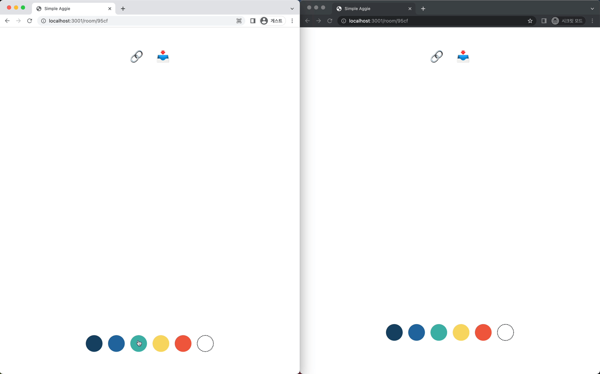

# Simple Aggie

협업 드로잉 툴 [Aggie.io](https://aggie.io/)의 간소화 버전 프로젝트입니다. 브라우저에서 실시간으로 친구들과 함께 그림을 그리고 공유할 수 있습니다.  
Socket을 사용하여 간단한 어플리케이션을 만들어보고 싶었는데, 이를 저의 취미인 그림과 결합하여 드로잉 툴을 만들면 좋겠다는 아이디어가 떠올라 만들게 되었습니다.



1. 아래 명령어를 입력하여 해당 레퍼지토리를 클론 할 수 있습니다.
```zsh
git clone https://github.com/davindev/simple-aggie.git
```

2. 아래 명령어를 입력하면 8080 포트에서 서버가 실행됩니다.
```zsh
cd simple-aggie-server
pnpm install
pnpm dev
```

3. 아래 명령어를 입력하면 3001 포트에서 클라이언트가 실행됩니다.
```zsh
cd simple-aggie-client
pnpm install
pnpm start
```

4. 브라우저에서 http://localhost:3001 로 진입하면 어플리케이션을 사용할 수 있습니다.

## Features
- 방 생성 및 링크 공유
- 실시간 드로잉 및 색상 팔레트
- PNG 파일로 변환 및 다운로드

## Skills
### Client
- TypeScript
- React (CRA)
- Socket.IO
- Tailwind CSS

### Server
- TypeScript
- Node.js
- Express
- Socket.IO

## Issue
- 이미 그림을 그린 방에 신규 유저가 입장했을 때, 신규 유저는 그림이 그려진 캔버스를 볼 수 없고 항상 새로운 캔버스를 보게 되는 이슈가 있습니다.
- 간헐적으로 캔버스에 직선이 그려지는 이슈가 있습니다.
